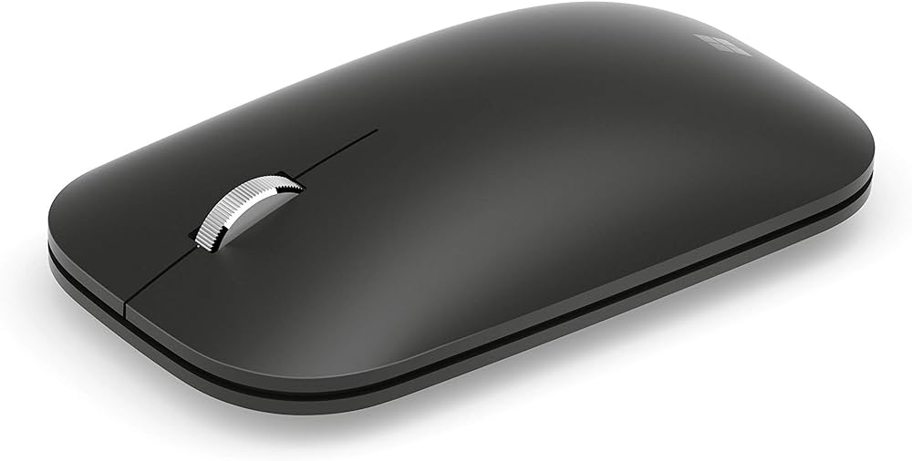

# bluey

### Rubbish attempts at a cli tool for dealing with annoying bluetooth issues, which is almost certainly of no use to anybody else.

Despite never owning any other microsoft hardware, I've been enjoying this mouse for a decent while now: 

It's fairly compact, minimal, feels nice in ya hand, fairly affordable, etc. etc. etc.

**HOWEVER**, it seems needlessly arduous to connect and disconnect between laptops, and it'll assign itself a new MAC address every time it pairs with a computer, which means my computers are left with a million orphaned versions of "Modern Mobile Mouse" listed under the paired devices from every time I switch between machines and later re-connect it.

I know this is a fairly common issue with various bluetooth devices across different operating systems, and there's probably a much simpler and smarter way to deal with this already in existence. Don't @ me. I'm just an idiot.

*DISCLAIMER: It is also very likely that I will never get this to a state where it actually works, but hey, at least I wrote **one** whole test.*
